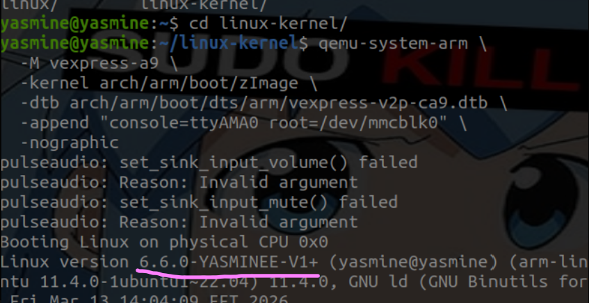
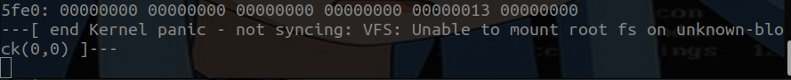
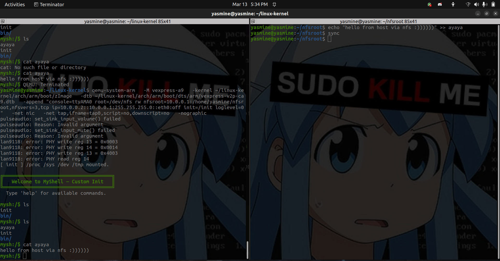

Custom Name in Version screenshot:

Kernel panic screenshot:

NFS vexpress screenshot:

### QUESTIONS
1) a monolithic kernel runs all core OS services (memory management, file systems, device drivers, scheduling) in one large block of code in kernel space, function calls between subsystems are fast because no context switching happens, just a direct call.
a microkernel strips down the kernel to the bare minimum (memory mapping, IPC, basic scheduling) and moves everything else drivers, file systems, networking into separate user-space servers, communication happens via message passing which is slower but safer, a buggy driver cant crash the whole system.
linux is a monothilic kernel, it supports kernel modules meaning that drivers can be compiled separately and removed/inserted at runtime.

2) Linux has many drivers, libraries, tools and community support.
Linux is free while QNX requires a license.
the entire toolchain for linux (gcc, clang, glibc, busybox, yocto is tested, documented and free.
linux is good enough for most embedded use cases (phones, tvs, etc) while QNX is truly needed in life-critical systems (flight control, surgical robots).
google chose linux for Android which alone forced the entire mobile industry to maintain linux.

3) before GKI, every Android phone ran a heavily modified vendor kernel, updating the kernel meant waiting for each vendor to backport security patches which they often didnt, leaving millions of devices with known vulnerabilities for years.
all new GKI devices benefit from:
security patches.
fragmentation: reduces the number of actively maintained kernel forks from hundreds to one.
faster android version updates.

4) the mainline torvalds/linux is the universal upstream linux kernel and it aims to generically support all hardware, vendor specific or experimental code is often not accepted upstream or takes years to get merged, so it may boot but you will lose camera, gpu acceleration and various peripheral support from rpi.

5) these are different packaging/compression formats of the same kernel, each suited to different boot environment.
vmlinux: uncompressed ELF binary output, used for debugging, large size, cant be booted directly, not position independent.
zimage: arm32 - a self-decompressing compressed kernel, the bootloader loads it, it decompresses itself into the RAM then jumps to the kernel entry point. what QEMU vexpress-A9 uses.
image: arm 64 - an uncompressed binary kernel, the bootloader loads it directly into a fixed RAM address and jumps to it, RPI 3b+ uses this format.
uimage: a zimage wrapped with a 64-byte uboot header using mkimage. the header tells the uboot the load address, entry point, crc and architecture. legacy format used with bootm command.
image.gz: a gzip-compressed version of image (arm64), saves sd card space. some bootloaders can decompress it while others need the uncompressed image.

6) DTB stands for device tree blob, it is a compact binary data structure that describes the hardware layout of a board to the kernel, how many cpus, what peripherals exist, their memory addresses, interrupt lines. clock sources and how theyre connected.
it is needed because linux kernel is generic, it doesnt know at compile time what device is being used, so instead of hardcoding that into the kernel, it reads the DTB file to know.
fdt_addr_r is a u-boot environment variable that defines the RAM address where the DTB should be loaded before booting. FDT stands for flatenned device tree, the binary format of device tree. when you run load mcc 0:1 ${fdt_addr_r} bcm2837-rpi-3-b-plus.dtb you are loading the hardware description for your exact rpi board model into the RAM at a known address that the kernel reads when it starts.

7) root=/dev/mmcblk0: tells the kernel which device contains the root filesystem.
rootfstype: tells the kernel which type of file systems is the partition that contains the root fs. disables auto detection which speeds up booting. common values: ext4, squashfs, fs, tmpfs.
console=ttyAMA0, 115200: redirects the kernel output to a serial port at baud rate 115200. used for debugging.
init=/bin/sh: overrides the default userspace process and drops straight to a shell.

8)bootz: boots a compressed image (zimage) ARM32, command: bootz ${kernel_addr_r} - ${fdt_addr_r}
booti: boots a flat uncompressed image (image) ARM64, command: booti ${kernel_addr_r} - ${fdt_addr_r}

9)VFS stands for virtual file system, the kernels abstraction layer for all filesystems, this panic means that the kernel successfully booted, decompressed, initialized all subsystems but then couldnt find or mount the root file system to start userspace.
common causes:
wrong root=.
missing filesystem.
missing kernel storage driver.
wrong rootfstype.

10) a dynamically linked library relies on ld-linux.so to load the shared libraries, since after kernel booting, there is no C runtime or ld-linux.so, so the binary fails silently and the kernel panics with "no working init found".
a statically linked library includes all the library code it needs directly into the executable. no external dependencies needed or dynamic linking.
if you forget -static: your init binary will compile fine and copy to the rootfs correctly but fail silently to execute at boot, giving kernel panic.

11) no rootfs is mounted.
/bin/sh is dynamically linked.
wrong architecture.
sh exists but depends on missing libraries.
the path is wrong.

12) the init process is special, the first userspace process and it runs before any other processes exist. there is no shell, no service manager, no dynamic linker daemon running. the only thing available is the kernel itself and whatever files exist on the root fs.
a dynamically linked library needs the runtime linker to be present and working before it can start executing your main() function. in minimal rootfs, that linker doesnt exist. so what happens is:
the kernel finds your binary and attempts to execve() it.
the kernel invokes the dynamic linker specified in the ELF header.
the linker isnt found -> execve() returns ENOENT.
kerneltries to fallback init paths (/sbin/init, /etc/init, /bin/init/, /bin/sh) all fail for the same reason.
kernel prints: no working init found.
fix: add -static to statically link the libraries needed.

